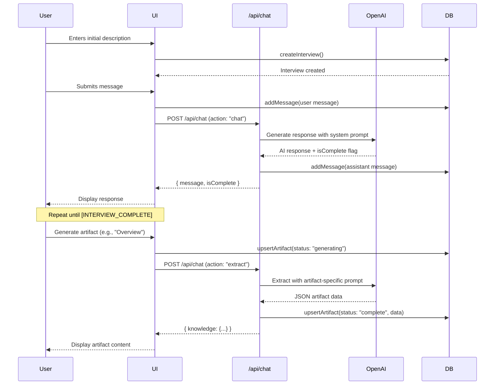

# Agent Guide to SpecBridge

> **Purpose**: This document provides AI coding assistants (like Claude or Antigravity) with a comprehensive understanding of the SpecBridge codebase architecture, design patterns, and implementation details.

## Quick Start

**SpecBridge** is an AI-driven knowledge extraction platform that conducts conversational interviews with domain experts to capture business processes, then generates structured artifacts (documentation, diagrams, rules, variables, edge cases) for developers to implement.

**Core Tech Stack**:
- **Framework**: Next.js 14.2 (App Router) with TypeScript 5.0
- **UI**: React 18.3, Tailwind CSS 3.4, shadcn/ui components
- **Database**: PostgreSQL with Prisma ORM 7.2
- **Auth**: Clerk 6.36.6 (optional, works without it for dev)
- **AI**: OpenAI GPT-4o
- **Diagrams**: Mermaid 11.12.2

---

## Project Structure

```
specbridge/
├── app/                      # Next.js App Router pages & API
│   ├── actions/
│   │   └── interview.ts      # Server Actions (all DB operations)
│   ├── api/
│   │   └── chat/route.ts     # POST /api/chat endpoint
│   ├── interview/[id]/
│   │   └── page.tsx          # Main interview workspace UI
│   ├── layout.tsx            # Root layout (Navbar + ClerkProvider)
│   ├── page.tsx              # Dashboard (interview list)
│   └── globals.css
│
├── components/
│   ├── chat/                 # Chat UI components
│   │   ├── chat-container.tsx
│   │   ├── chat-input.tsx
│   │   ├── message-bubble.tsx
│   │   ├── starter-prompts.tsx
│   │   └── answer-suggestions.tsx
│   ├── layout/               # Layout components
│   ├── ui/                   # shadcn/ui primitives
│   └── mermaid-diagram.tsx   # Mermaid renderer with error handling
│
├── config/
│   ├── prompts/
│   │   ├── interview.ts      # Interview system prompt & phases
│   │   ├── extraction.ts     # Artifact extraction prompts
│   │   └── suggestions.ts    # Answer suggestion prompts
│   └── constants.ts
│
├── hooks/
│   ├── use-interview.ts      # Single interview state management
│   ├── use-interviews.ts     # Interview list management
│   └── use-starter-prompts.ts
│
├── lib/
│   ├── prisma.ts             # Prisma client singleton
│   ├── openai.ts             # OpenAI client & helpers
│   └── types.ts
│
├── prisma/
│   └── schema.prisma         # Database schema (Interview, Message, Artifact)
│
├── spc/                      # Spec documents (product vision, flows, etc.)
├── middleware.ts             # Clerk auth middleware
└── railway.json              # Railway deployment config
```

---

## Architecture Patterns

### 1. **Server Actions for All Database Operations**

All database mutations go through Next.js Server Actions in [`app/actions/interview.ts`](file:///Users/marcokotrotsos/PERSONAL/specbridge/app/actions/interview.ts):

```typescript
"use server";

export async function createInterview(data) { ... }
export async function getInterview(id) { ... }
export async function updateInterview(id, data) { ... }
export async function addMessage(interviewId, data) { ... }
export async function upsertArtifact(interviewId, data) { ... }
export async function deleteArtifact(id) { ... }
```

**Why**: 
- Type-safe server-client communication
- Automatic revalidation with `revalidatePath()`
- Keeps DB logic server-side only
- Works seamlessly with React Server Components

### 2. **Optimistic UI Updates via Custom Hooks**

The [`useInterview`](file:///Users/marcokotrotsos/PERSONAL/specbridge/hooks/use-interview.ts) hook manages interview state with optimistic updates:

```typescript
const addMessage = useCallback(async (message) => {
  // Call server action
  const newMessage = await addMessageAction(id, { ...message });
  
  // Optimistically update local state immediately
  setInterview(prev => ({
    ...prev,
    messages: [...prev.messages, newMessage]
  }));
}, [interview, id]);
```

**Pattern**: Server action → Optimistic state update → UI reacts instantly

### 3. **Ref-Based State for Async Operations**

To avoid stale closures in async operations:

```typescript
const interviewRef = useRef<InterviewData | null>(null);
useEffect(() => {
  interviewRef.current = interview;
}, [interview]);

// Later, in async callback:
const updateArtifact = useCallback(async (artifactId, updates) => {
  const currentInterview = interviewRef.current; // Always latest
  // ... use currentInterview
}, [id]);
```

**Why**: Prevents bugs where async operations reference outdated state

### 4. **Single API Route with Action Multiplexing**

[`POST /api/chat`](file:///Users/marcokotrotsos/PERSONAL/specbridge/app/api/chat/route.ts) handles multiple actions via `action` parameter:

```typescript
// Request body
{
  messages: ChatMessage[],
  action?: "chat" | "suggestions" | "extract",
  artifactType?: ArtifactType,
  settings?: { diagramType?: "flowchart" | "sequence" }
}

// Handler switches on action
switch (action) {
  case "chat": // Interview conversation
  case "suggestions": // Generate answer suggestions
  case "extract": // Extract artifact from transcript
}
```

**Why**: Centralizes AI operations, reuses auth/error handling

### 5. **Lazy OpenAI Client Initialization**

```typescript
let openaiClient: OpenAI | null = null;

function getOpenAI(): OpenAI {
  if (!openaiClient) {
    openaiClient = new OpenAI({ apiKey: process.env.OPENAI_API_KEY });
  }
  return openaiClient;
}
```

**Why**: Avoids build-time errors when env vars aren't set (e.g., CI)

---

## Database Schema

**Three core models** ([`prisma/schema.prisma`](file:///Users/marcokotrotsos/PERSONAL/specbridge/prisma/schema.prisma)):

### Interview
```prisma
model Interview {
  id                 String     @id @default(cuid())
  userId             String?    // Clerk user ID (optional)
  title              String
  initialDescription String     @default("")
  status             String     @default("in_progress")
  extractedKnowledge Json?      // Legacy field
  createdAt          DateTime   @default(now())
  updatedAt          DateTime   @updatedAt
  messages           Message[]
  artifacts          Artifact[]
  
  @@index([userId])
}
```

### Message
```prisma
model Message {
  id          String    @id @default(cuid())
  interviewId String
  interview   Interview @relation(...)
  role        String    // "assistant" | "user"
  content     String
  timestamp   DateTime  @default(now())
  
  @@index([interviewId])
}
```

### Artifact
```prisma
model Artifact {
  id          String    @id @default(cuid())
  interviewId String
  interview   Interview @relation(...)
  type        String    // "overview" | "decision-tree" | "rules" | "variables" | "edge-cases"
  title       String
  status      String    @default("generating") // "generating" | "complete" | "error"
  data        Json?
  error       String?
  createdAt   DateTime  @default(now())
  
  @@index([interviewId])
}
```

**Key Design Decisions**:
- `userId` is nullable (works without auth in dev)
- Cascade deletes: deleting an interview deletes all messages/artifacts
- JSON fields for flexible artifact data structures
- Indexed on `userId` and `interviewId` for query performance

---

## Interview Flow



---

## Prompt Architecture

### Interview System Prompt

Location: [`config/prompts/interview.ts`](file:///Users/marcokotrotsos/PERSONAL/specbridge/config/prompts/interview.ts)

**Structure**:
1. **Role**: "You are SpecBridge, an expert AI interviewer..."
2. **Methodology**: 4-phase interview structure
   - **Phase 1: UNDERSTAND** (Q1-3) - High-level overview
   - **Phase 2: DETAIL** (Q4-7) - Specific conditions, formulas, thresholds
   - **Phase 3: EXCEPTIONS** (Q8-10) - Edge cases, conflicts
   - **Phase 4: VALIDATE** (Q11-12) - Confirm with examples
3. **Domain Detection**: Adapts to calculation/workflow/validation/state transitions/data transformation
4. **Rules**: ONE question at a time, no technical jargon, probe vagueness
5. **Completion Signal**: `[INTERVIEW_COMPLETE]` when sufficient knowledge extracted

**Key Pattern**: The AI detects when `[INTERVIEW_COMPLETE]` appears in the response to set `isComplete: true`

### Artifact Extraction Prompts

Location: [`config/prompts/extraction.ts`](file:///Users/marcokotrotsos/PERSONAL/specbridge/config/prompts/extraction.ts) and inline in [`app/api/chat/route.ts`](file:///Users/marcokotrotsos/PERSONAL/specbridge/app/api/chat/route.ts)

Each artifact type has a dedicated prompt:
- **Overview**: Process documentation with summary, steps, stakeholders, edge cases
- **Decision Tree**: Mermaid flowchart or sequence diagram
- **Rules**: IF/THEN business rules with priority/precedence
- **Variables**: Data model with types, constraints, valid values
- **Edge Cases**: Exception scenarios and open questions

**Pattern**: 
1. Build transcript from all messages
2. Select artifact-specific prompt from `ARTIFACT_PROMPTS`
3. Request JSON response with defined schema
4. Strip markdown code blocks from response
5. Parse JSON and store in `Artifact.data`

---

## State Management Strategy

### Philosophy

- **No Redux/Zustand**: Uses React hooks + Server Actions
- **Server as source of truth**: Database via Prisma
- **Local state for UI**: Selected artifact, modals, loading states
- **Optimistic updates**: Immediate UI feedback, then confirm with server

### Hook Responsibilities

**[`useInterview(id)`](file:///Users/marcokotrotsos/PERSONAL/specbridge/hooks/use-interview.ts)**
- Loads single interview with messages & artifacts
- Auto-creates if not found (via `autoCreate` option)
- Provides methods: `addMessage`, `setTitle`, `setInitialDescription`, `addArtifact`, `updateArtifact`, `deleteArtifact`
- Returns: `{ interview, isLoading, error, ...methods, refresh }`

**[`useInterviews()`](file:///Users/marcokotrotsos/PERSONAL/specbridge/hooks/use-interviews.ts)**
- Loads all interviews for current user
- Provides: `deleteInterview`, `refresh`

### Data Flow Example

```
[User clicks "Generate Overview"]
  ↓
[UI: Optimistically add artifact with status="generating"]
  ↓
[Call API: POST /api/chat with action="extract"]
  ↓
[API: Call OpenAI, get JSON response]
  ↓
[API: Update DB via upsertArtifact]
  ↓
[UI: Update local state with complete artifact]
  ↓
[UI: Render artifact content]
```

---

## UI Architecture

### Layout Structure

```
app/layout.tsx (Root)
├── ClerkProvider (auth)
├── Navbar
│   ├── Logo → "/"
│   └── UserButton / SignInButton
└── {children}

app/page.tsx (Dashboard)
├── Header ("Your Interviews")
├── NewInterviewButton
└── InterviewList
    └── InterviewCard[] (map over interviews)

app/interview/[id]/page.tsx (Interview Workspace)
└── PanelGroup (horizontal, resizable)
    ├── ChatPanel (Panel, defaultSize=60%)
    │   ├── Header (title, editable)
    │   └── ChatContainer
    │       ├── MessageList
    │       │   ├── StarterPrompts (if empty)
    │       │   └── MessageBubble[] (map)
    │       ├── AnswerSuggestions (if enabled)
    │       └── ChatInput
    │
    ├── PanelResizeHandle
    │
    └── StudioPanel (Panel, defaultSize=40%)
        ├── Header ("Studio")
        └── {selectedArtifact ? DetailView : ListView}
            ├── ListView
            │   ├── ArtifactTypeGrid (5 buttons: Overview, Decision Tree, Rules, Variables, Edge Cases)
            │   └── GeneratedArtifacts (list of completed artifacts)
            │
            └── DetailView
                ├── BackButton
                ├── ArtifactHeader (title, regenerate, delete)
                └── ArtifactContent (switches on type)
                    ├── OverviewContent
                    ├── DecisionTreeContent (Mermaid)
                    ├── RulesContent
                    ├── VariablesContent
                    └── EdgeCasesContent
```

**Component Library**: Uses shadcn/ui primitives (Button, Card, Input, etc.) with Tailwind classes

---

## Authentication Strategy

### Clerk Integration

- **Middleware**: [`middleware.ts`](file:///Users/marcokotrotsos/PERSONAL/specbridge/middleware.ts) - `clerkMiddleware()` on all routes except static files
- **Auth in Server Actions**: `const { userId } = await auth();` from `@clerk/nextjs/server`
- **Filtering**: All queries filter by `userId` when present
- **Optional Auth**: Works without Clerk env vars (for dev/builds)

**Pattern**:
```typescript
export async function getAllInterviews() {
  const { userId } = await auth();
  
  const interviews = await prisma.interview.findMany({
    where: userId ? { userId } : {}, // If no auth, return all
    // ...
  });
}
```

---

## Error Handling Patterns

### Mermaid Diagram Rendering

Component: [`components/mermaid-diagram.tsx`](file:///Users/marcokotrotsos/PERSONAL/specbridge/components/mermaid-diagram.tsx)

```typescript
// Retry logic (3 attempts)
for (let attempt = 0; attempt < retries; attempt++) {
  try {
    const { svg } = await mermaid.render(id, syntax);
    // DOMPurify sanitize
    return <div dangerouslySetInnerHTML={{ __html: sanitizedSvg }} />;
  } catch (error) {
    if (attempt === retries - 1) {
      // Show error + raw syntax
      return <ErrorDisplay />;
    }
  }
}
```

### API Error Handling

```typescript
try {
  const response = await openai.chat.completions.create(...);
  // Strip markdown code blocks
  let json = response.trim();
  if (json.startsWith("```json")) json = json.slice(7);
  if (json.endsWith("```")) json = json.slice(0, -3);
  
  return JSON.parse(json);
} catch (error) {
  return NextResponse.json({ error: error.message }, { status: 500 });
}
```

---

## Key Implementation Details

### 1. **Artifact Generation Settings**

Some artifacts (decision-tree) accept settings:

```typescript
// UI passes diagram preference
const settings = { diagramType: "flowchart" | "sequence" };

// API uses it to customize extraction prompt
const diagramInstructions = settings?.diagramType === "sequence" 
  ? SEQUENCE_DIAGRAM_RULES 
  : FLOWCHART_DIAGRAM_RULES;
```

### 2. **Message Transcript Building**

API builds context for OpenAI from DB messages:

```typescript
const conversationHistory = messages.map(msg => ({
  role: msg.role,
  content: msg.content
}));

const response = await generateResponse(
  conversationHistory,
  INTERVIEW_SYSTEM_PROMPT
);
```

### 3. **Interview Completion Detection**

```typescript
// In API route
const assistantResponse = await generateResponse(...);
const isComplete = assistantResponse.includes("[INTERVIEW_COMPLETE]");

return NextResponse.json({ 
  message: assistantResponse.replace("[INTERVIEW_COMPLETE]", "").trim(),
  isComplete 
});
```

UI checks `isComplete` to update interview status.

### 4. **Auto-Scroll on New Messages**

In [`chat-container.tsx`](file:///Users/marcokotrotsos/PERSONAL/specbridge/components/chat/chat-container.tsx):

```typescript
const scrollToBottom = () => {
  messagesEndRef.current?.scrollIntoView({ behavior: "smooth" });
};

useEffect(() => {
  scrollToBottom();
}, [messages]);
```

### 5. **Starter Prompts**

Predefined templates in [`config/prompts/interview.ts`](file:///Users/marcokotrotsos/PERSONAL/specbridge/config/prompts/interview.ts):

```typescript
export const STARTER_PROMPTS = [
  { title: "Customer discount calculation", description: "..." },
  { title: "Purchase approval workflow", description: "..." },
  // ...
];
```

Displayed when no messages exist yet.

---

## Deployment Architecture

**Platform**: Railway

**Configuration** ([`railway.json`](file:///Users/marcokotrotsos/PERSONAL/specbridge/railway.json)):
```json
{
  "build": { "builder": "NIXPACKS" },
  "deploy": {
    "startCommand": "npm start",
    "healthcheckPath": "/",
    "healthcheckTimeout": 180
  }
}
```

**Database**: Railway PostgreSQL
- Internal URL for production
- Public URL for local development

**Environment Variables**:
```env
DATABASE_URL=postgresql://...
OPENAI_API_KEY=sk-...
NEXT_PUBLIC_CLERK_PUBLISHABLE_KEY=pk_... (optional)
CLERK_SECRET_KEY=sk_... (optional)
```

---

## Common Development Patterns

### Adding a New Artifact Type

1. **Update types**: Add to `ArtifactType` in [`app/actions/interview.ts`](file:///Users/marcokotrotsos/PERSONAL/specbridge/app/actions/interview.ts)
2. **Create prompt**: Add to `ARTIFACT_PROMPTS` in [`app/api/chat/route.ts`](file:///Users/marcokotrotsos/PERSONAL/specbridge/app/api/chat/route.ts)
3. **Add UI config**: Add to `ARTIFACT_TYPES` array in [`app/interview/[id]/page.tsx`](file:///Users/marcokotrotsos/PERSONAL/specbridge/app/interview/[id]/page.tsx)
4. **Create renderer**: Add `<NewTypeContent>` component in interview page
5. **Update switch**: Add case in `<ArtifactContent>` component

### Modifying Interview Behavior

Edit [`config/prompts/interview.ts`](file:///Users/marcokotrotsos/PERSONAL/specbridge/config/prompts/interview.ts):
- Change `INTERVIEW_SYSTEM_PROMPT` to adjust questions/methodology
- Modify `INTERVIEW_CONFIG` to change max questions or phase boundaries
- Update `STARTER_PROMPTS` for different templates

### Adding a New Server Action

1. Define in [`app/actions/interview.ts`](file:///Users/marcokotrotsos/PERSONAL/specbridge/app/actions/interview.ts) with `"use server"`
2. Use `await auth()` for user context
3. Call Prisma client operations
4. Call `revalidatePath()` if data changed
5. Return typed data (defined in `lib/types.ts`)

---

## Performance Considerations

1. **Prisma Connection Pooling**: Singleton pattern in [`lib/prisma.ts`](file:///Users/marcokotrotsos/PERSONAL/specbridge/lib/prisma.ts)
2. **Lazy OpenAI Init**: Client created on first API call only
3. **Optimistic Updates**: UI responds immediately before server confirms
4. **Panel State Persistence**: `react-resizable-panels` remembers sizes
5. **Mermaid Singleton**: Single initialization, reused for all diagrams
6. **Auto-scroll Debouncing**: Smooth scrolling without jank

**Target Metrics** (from spec):
- Chat responses: < 3s
- Artifact generation: < 10s
- Page load: < 2s

---

## Testing & Debugging

### Check Interview State

```typescript
// In browser console (React DevTools)
const { interview } = useInterview({ id: "interview-id" });
console.log(interview.messages);
console.log(interview.artifacts);
```

### Test API Directly

```bash
curl -X POST http://localhost:3000/api/chat \
  -H "Content-Type: application/json" \
  -d '{
    "messages": [{"role": "user", "content": "Test"}],
    "action": "chat"
  }'
```

### Database Inspection

```bash
npx prisma studio
# Opens GUI at http://localhost:5555
```

### View Logs (Railway)

```bash
# Install CLI
npm i -g @railway/cli

# Login and view logs
railway login
railway logs
```

---

## Common Pitfalls & Solutions

### Issue: Stale State in Async Callbacks
**Solution**: Use `useRef` pattern (see "Ref-Based State" above)

### Issue: Mermaid Rendering Fails
**Solution**: Check syntax in error display, regenerate with clearer instructions to OpenAI

### Issue: Artifact JSON Parse Error
**Solution**: Check `lib/openai.ts` - strips markdown code blocks, logs raw response on failure

### Issue: Auth Not Working
**Solution**: Verify Clerk env vars set, check middleware matcher config

### Issue: Database Connection Fails
**Solution**: Check `DATABASE_URL` format, ensure Railway service running

---

## Future Extension Points

From [`spec.md`](file:///Users/marcokotrotsos/PERSONAL/specbridge/spec.md) Phase 2/3:

- **Export Formats**: Add export handlers (PDF, Markdown, JSON) in API routes
- **Sharing**: Add `sharedWith` field to Interview model
- **Version History**: Add `ArtifactVersion` model with parent artifact
- **Custom Templates**: Add `prompt_templates` table, UI for editing
- **Multi-language**: i18n with `next-intl`

---

## Documentation References

- **Product Spec**: [`spec.md`](file:///Users/marcokotrotsos/PERSONAL/specbridge/spec.md) - Features, user flows, NFRs
- **Technical Design**: [`DESIGN.md`](file:///Users/marcokotrotsos/PERSONAL/specbridge/DESIGN.md) - Architecture diagrams, data flow
- **Spec Docs**: [`spc/`](file:///Users/marcokotrotsos/PERSONAL/specbridge/spc) - Product vision, architecture, data models, UI design, prompts

---

## Working with This Codebase

### When making changes:

1. **Understand the flow**: Interview → Messages → Artifacts
2. **Server Actions first**: All DB ops go through `app/actions/interview.ts`
3. **API for AI**: `/api/chat` handles all OpenAI interactions
4. **Prompts are logic**: Changing prompts changes behavior as much as code
5. **Optimistic UI**: Update state optimistically, don't wait for server
6. **Type safety**: Leverage TypeScript, use defined types in `app/actions/interview.ts`

### Local development:

```bash
# Install
npm install

# Setup DB
npx prisma generate
npx prisma db push

# Run dev server
npm run dev
# Open http://localhost:3000

# View DB
npx prisma studio
```

### Making database changes:

```bash
# Edit prisma/schema.prisma
# Then:
npx prisma db push  # For dev (direct to DB)
# OR
npx prisma migrate dev --name your_migration_name  # For production

npx prisma generate  # Update Prisma client
```

---

## Summary

**SpecBridge** is a well-architected Next.js application that demonstrates modern patterns:

- ✅ **App Router** with Server Actions
- ✅ **Type-safe** database with Prisma
- ✅ **Optimistic UI** for responsive feel
- ✅ **Prompt engineering** as core logic
- ✅ **Optional auth** for flexibility
- ✅ **Clean separation**: UI → Hooks → Actions → DB/API

**Key Insight**: This app's "business logic" is primarily in the prompts (`config/prompts/`), not traditional code. Changing how SpecBridge behaves often means editing system prompts, not implementing new algorithms.

When working with this codebase, think in terms of **conversation flow** and **knowledge extraction patterns** rather than traditional CRUD operations.
