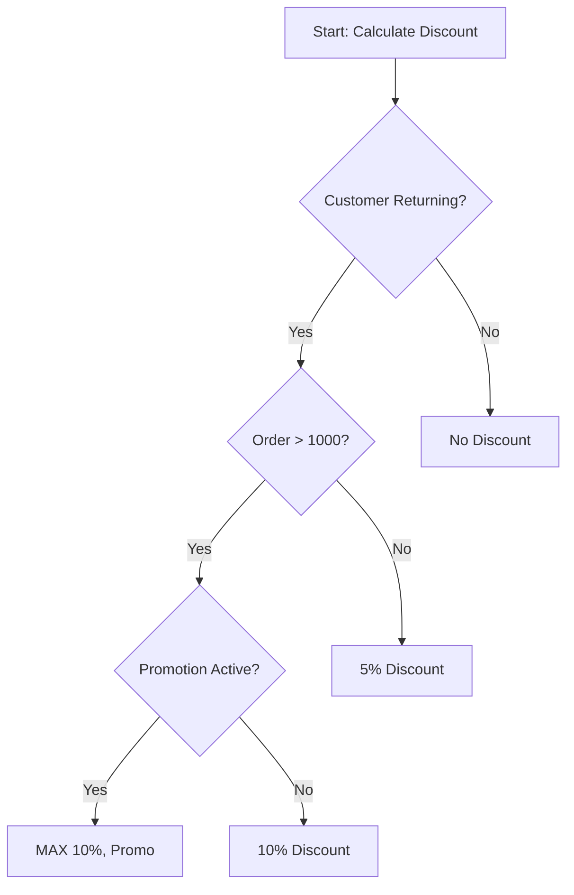
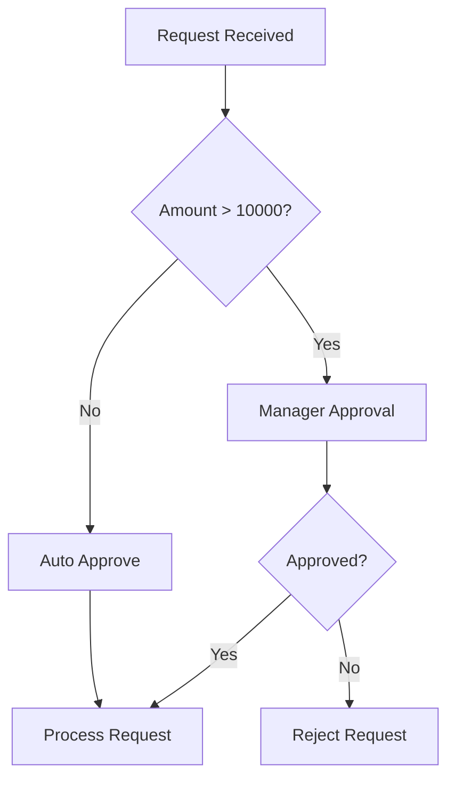

# Data Models

## Interview Input Format

Input received by the Knowledge Extraction Processor:

```json
{
  "expert_description": "[initial description from expert]",
  "conversation": [
    {"role": "bridgespec", "content": "..."},
    {"role": "expert", "content": "..."}
  ]
}
```

## Extracted Knowledge Structure

Output from the Knowledge Extraction Processor:

```json
{
  "metadata": {
    "domain": "[pricing|workflow|validation|state_machine|data_transformation|other]",
    "process_name": "[expert's name for this process]",
    "complexity": "[simple|moderate|complex]",
    "interview_date": "[timestamp]"
  },

  "summary": {
    "one_line": "[single sentence summary]",
    "detailed": "[2-3 paragraph explanation]",
    "key_actors": ["[people or systems involved]"],
    "inputs": ["[what triggers or starts this]"],
    "outputs": ["[what results from this]"]
  },

  "rules": [
    {
      "id": "rule_1",
      "description": "[plain English description]",
      "formal_condition": "[if X then Y format]",
      "priority": 1,
      "examples": ["[concrete examples from interview]"],
      "source": "[which exchange this came from]"
    }
  ],

  "edge_cases": [
    {
      "scenario": "[description of edge case]",
      "handling": "[how it's handled]",
      "status": "[documented|ambiguous|missing]"
    }
  ],

  "ambiguities": [
    {
      "issue": "[what's unclear]",
      "impact": "[why it matters]",
      "suggested_question": "[what to ask expert for clarification]"
    }
  ],

  "dependencies": [
    {
      "element_a": "[first element]",
      "relationship": "[depends_on|triggers|modifies|etc]",
      "element_b": "[second element]"
    }
  ],

  "recommended_artifacts": {
    "decision_tree": {
      "recommended": true,
      "reason": "[why this visualization helps]"
    },
    "flowchart": {
      "recommended": false,
      "reason": "[why not needed]"
    },
    "state_diagram": {
      "recommended": false,
      "reason": "[why not needed]"
    },
    "pseudo_code": {
      "recommended": true,
      "reason": "[why this helps]"
    }
  }
}
```

## Domain Types

| Domain | Description | Typical Artifacts |
|--------|-------------|-------------------|
| `pricing` | Discount rules, price calculations | Decision tree, pseudo-code |
| `workflow` | Approval processes, task flows | Flowchart, state diagram |
| `validation` | Data validation rules | Decision tree, test cases |
| `state_machine` | Status transitions | State diagram |
| `data_transformation` | Data mapping, conversion | Pseudo-code, mapping table |
| `other` | Catch-all for unrecognized domains | Decision tree |

## Rule Structure

### Rule Definition

```typescript
interface Rule {
  id: string;                    // Unique identifier (e.g., "rule_1")
  description: string;           // Plain English description
  formal_condition: string;      // Formalized IF-THEN format
  priority: number;              // Order of evaluation (1 = highest)
  examples: string[];            // Concrete examples from interview
  source: string;                // Reference to conversation exchange
}
```

### Formal Condition Syntax

Rules should be expressed in a readable pseudo-code format:

```
IF <condition> THEN <action>
IF <condition> AND <condition> THEN <action>
IF <condition> OR <condition> THEN <action>
IF <condition> THEN <action> ELSE <action>
```

Examples:
- `IF customer.returning AND order.total > 1000 THEN discount = 0.10`
- `IF category = 'Capital Equipment' AND amount >= 50000 THEN require_board_approval`
- `IF promotion.active THEN discount = MAX(base_discount, promotion.discount)`

## Edge Case Structure

```typescript
interface EdgeCase {
  scenario: string;              // Description of the edge case
  handling: string;              // How it's currently handled
  status: 'documented' | 'ambiguous' | 'missing';
}
```

Status meanings:
- `documented`: Expert provided clear handling
- `ambiguous`: Expert mentioned but unclear
- `missing`: Identified by AI but not addressed

## Ambiguity Structure

```typescript
interface Ambiguity {
  issue: string;                 // What's unclear
  impact: string;                // Why it matters for implementation
  suggested_question: string;    // Follow-up question for expert
}
```

## Mermaid Diagram Output

### Decision Tree Example



### Flowchart Example



## Pseudo-code Output Format

```python
def calculate_discount(customer, order, promotion):
    # Rule 1: Returning customers with large orders
    if customer.is_returning and order.total > 1000:
        if promotion.is_active:
            # Rule 2: Apply better of base or promo discount
            return max(0.10, promotion.discount)
        else:
            return 0.10

    # Rule 3: Returning customers with smaller orders
    elif customer.is_returning:
        return 0.05

    # Rule 4: New customers
    else:
        return 0.0
```

## Test Scenario Structure

```typescript
interface TestScenario {
  name: string;
  inputs: Record<string, any>;
  expected_output: any;
  rule_tested: string;           // Reference to rule_id
}
```

Example:
```json
{
  "name": "Returning customer large order with promotion",
  "inputs": {
    "customer.is_returning": true,
    "order.total": 1500,
    "promotion.is_active": true,
    "promotion.discount": 0.15
  },
  "expected_output": 0.15,
  "rule_tested": "rule_2"
}
```
