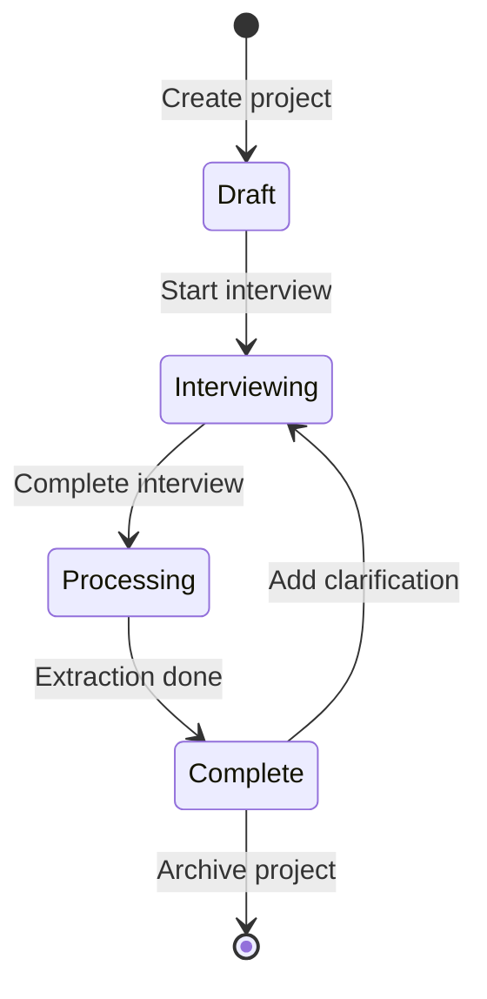

# User Flows

## Overview

BridgeSpec has two primary user types:
1. **Expert**: Domain expert who provides business knowledge
2. **Implementer**: Technical person who consumes structured knowledge

---

## Expert User Flow

### 1. Create New Project

```
Expert lands on home page
    |
    v
Clicks "New Project"
    |
    v
Enters project name: "Customer Discount Calculation"
    |
    v
Provides initial description:
"I need to document how we calculate customer discounts
based on their tier and order value"
    |
    v
Clicks "Start Interview"
```

### 2. Adaptive Interview Session

```
BridgeSpec analyzes description
    |
    v
Identifies domain: Pricing/Calculation
    |
    v
Generates first question:
"Let's start with the basics - what factors
determine the discount amount?"
    |
    v
Expert answers in natural language:
"Customer type, order value, and whether
there's an active promotion"
    |
    v
BridgeSpec probes deeper:
"What are the specific customer types,
and how is a customer assigned to each?"
    |
    v
[Continues for 10-15 exchanges]
    |
    v
BridgeSpec validates understanding:
"Let me verify - if a Gold customer places a
$2000 order during a 15% promo, they'd get 15%?"
    |
    v
Expert confirms or corrects
    |
    v
Interview marked complete
```

### 3. Async Refinement (Optional)

```
Expert returns later
    |
    v
Opens existing project
    |
    v
Sees "Add clarification" option
    |
    v
Adds forgotten edge case:
"I forgot to mention - we also have a
special rate for government customers"
    |
    v
BridgeSpec asks follow-up questions
    |
    v
Knowledge base updates
```

---

## Implementer User Flow

### 1. Browse Projects

```
Implementer lands on home page
    |
    v
Sees list of projects with status:
- Customer Discount (Complete)
- Shipping Calculator (In Progress)
- Returns Policy (Complete)
    |
    v
Clicks "Customer Discount"
```

### 2. View Knowledge

```
Project dashboard loads
    |
    +---> Summary Tab
    |     - One-line description
    |     - Key actors
    |     - Inputs/outputs
    |
    +---> Rules Tab
    |     - Formalized rules list
    |     - Priority order
    |     - Examples for each
    |
    +---> Decision Tree Tab
    |     - Mermaid diagram visualization
    |     - Interactive zoom/pan
    |
    +---> Pseudo-code Tab
    |     - Generated code logic
    |     - Copy to clipboard
    |
    +---> Edge Cases Tab
    |     - Documented cases
    |     - Ambiguous cases (highlighted)
    |     - Missing cases (flagged)
    |
    +---> Ambiguities Tab
          - Unclear items
          - Suggested questions
          - "Request clarification" button
```

### 3. Ask Questions

```
Implementer has question:
"What happens if both Gold tier AND
active promo apply?"
    |
    v
Types in "Ask a question" box
    |
    v
BridgeSpec searches conversation
    |
    v
Returns answer with source:
"Based on exchange #7: The expert stated
'take the higher discount of the two'"
    |
    v
If not found:
"This wasn't explicitly covered. Suggested
follow-up for expert: [question]"
```

### 4. Request Clarification

```
Implementer finds ambiguity
    |
    v
Clicks "Request Clarification"
    |
    v
Selects or writes question
    |
    v
Notification sent to expert
    |
    v
Expert responds (async)
    |
    v
Knowledge base updates
    |
    v
Implementer notified of update
```

### 5. Export Knowledge

```
Implementer satisfied with knowledge
    |
    v
Clicks "Export"
    |
    v
Chooses format:
- Markdown documentation
- JSON data
- Mermaid diagram code
- Pseudo-code snippet
    |
    v
Downloads file or copies to clipboard
```

---

## Complete Session Example

### Scenario: Approval Workflow Documentation

**Expert Session:**

```
1. Expert: "I want to document our purchase request approval process"

2. BridgeSpec: "Let's start with the basics - who can submit a purchase
   request, and what information do they need to provide?"

3. Expert: "Any employee can submit. They need the item description,
   vendor, cost, and category."

4. BridgeSpec: "What happens after submission - who reviews it first?"

5. Expert: "Depends on the amount. Under $1000 goes straight to the
   department manager. Over that, it needs finance review first."

6. BridgeSpec: "What does finance check for in their review?"

7. Expert: "Budget availability and proper coding. If those pass,
   it goes to the manager."

8. BridgeSpec: "What can the manager do - approve, reject, or anything else?"

9. Expert: "Approve, reject, or request changes. If approved, purchases
   under $10,000 are done. Over that needs director approval."

10. BridgeSpec: "Are there any exceptions to these thresholds?"

11. Expert: "Yes - IT equipment over $5000 needs IT director sign-off
    regardless of the regular approval path."

12. BridgeSpec: "Let me verify - a $7000 laptop would need: finance review,
    manager approval, AND IT director approval?"

13. Expert: "Correct."

[Interview complete]
```

**Implementer Session:**

```
1. Views decision tree showing approval flow

2. Sees rules:
   - R1: amount < 1000 -> manager only
   - R2: amount >= 1000 -> finance first
   - R3: amount >= 10000 -> director required
   - R4: IT equipment >= 5000 -> IT director required

3. Notices ambiguity flagged:
   "What if IT equipment is under $1000? Does it skip finance?"

4. Asks question in interface

5. Gets response: "Not explicitly covered. Suggested question for expert:
   For IT equipment under $1000, does it bypass finance review entirely
   or just the IT director requirement?"

6. Clicks "Request Clarification"

7. Expert responds: "Under $1000 IT equipment just needs manager approval,
   no IT director needed."

8. Knowledge base updates with new rule R5
```

---

## State Diagram: Project Lifecycle



## Notification Flow

```
Expert completes interview
    |
    v
System processes extraction
    |
    v
Implementer notified: "New project ready"
    |
    v
Implementer requests clarification
    |
    v
Expert notified: "Clarification needed"
    |
    v
Expert responds
    |
    v
Implementer notified: "Project updated"
```

---

## Error States

### Interview Abandoned
- Project stays in "Draft" status
- Expert can resume later
- Conversation history preserved

### Extraction Failed
- Rare case where AI cannot structure knowledge
- Falls back to raw conversation display
- Manual extraction option available

### Expert Unavailable for Clarification
- Ambiguities remain flagged
- Implementer can proceed with documented knowledge
- System suggests assumptions to make
